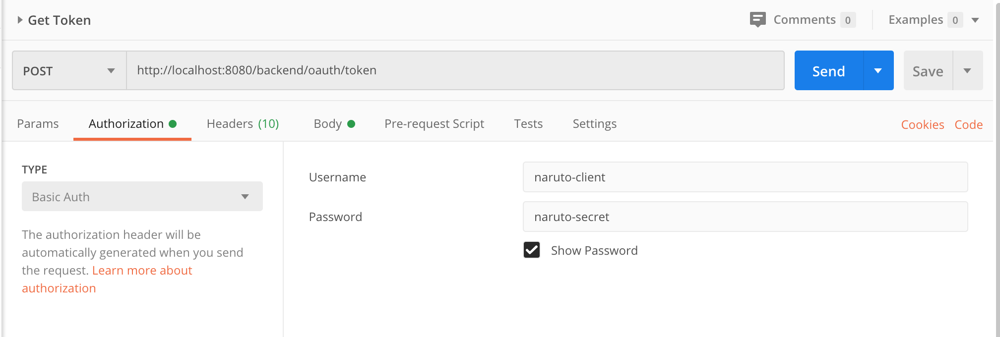
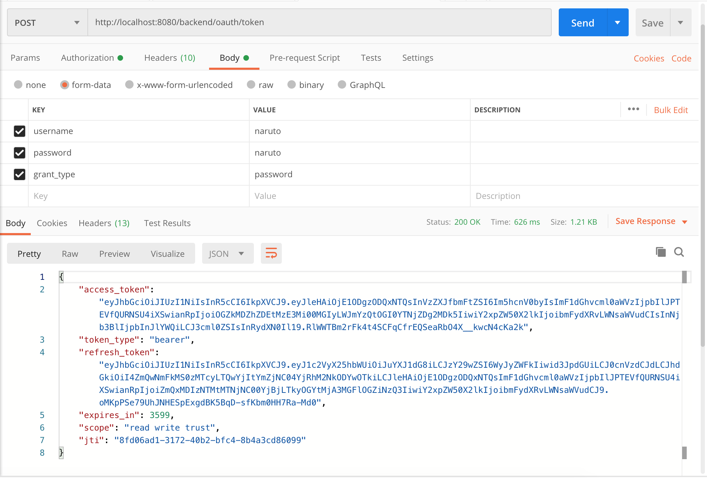
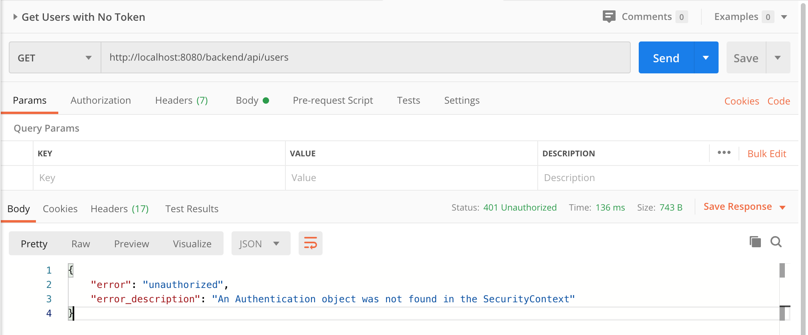
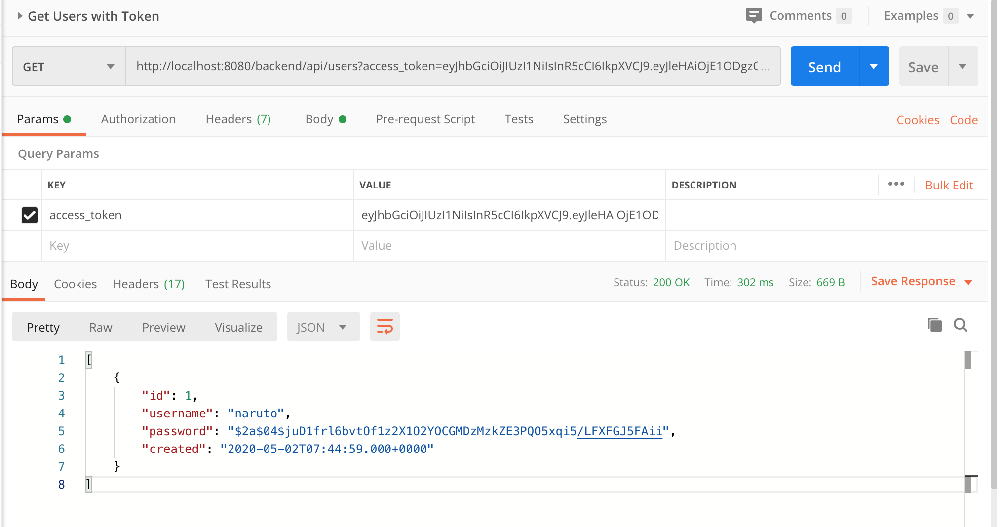

# SpringBoot-Kotlin-OAuth2
### Things todo list:
1. Clone this repository: `git clone https://github.com/hendisantika/SpringBoot-Kotlin-OAuth2.git`
2. Go inside the folder: `cd SpringBoot-Kotlin-OAuth2`
3. Run this query to insert new user:
    ```sql
    INSERT INTO users (id, username, password)
    VALUES      (1, 
                 'naruto', 
                 '$2a$04$juD1frl6bvtOf1z2X1O2YOCGMDzMzkZE3PQO5xqi5/LFXFGJ5FAii');
    ``` 
   Password is using BCrypt: `naruto`
4. Run the application: `gradle clean bootRun --info`
5. Open POSTMAN to test API

### Screen shot

Get Token





Access Without Token



Access With Token

